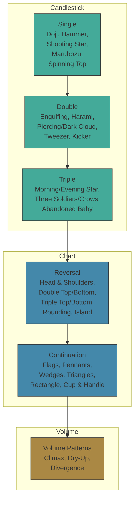

# Candle AI: Classical Patterns — Knowledge Base

## Purpose

This document is the **canonical reference** for every technical analysis
pattern recognized by Candle AI. It defines:

- **Recognition criteria** — objective, programmable rules for detection
- **Market psychology** — the supply/demand imbalance each pattern reveals
- **Statistical edge** — win rates from academic literature (Bulkowski, Nison)
- **Regime dependency** — how pattern meaning changes with market context
- **Confirmation requirements** — volume, follow-through, and indicator alignment
- **Reliability grade** — A (highest) through D (lowest) for standalone use
- **Implementation status** — ✅ detected today or 🔮 planned for future

This is a **living document**. As new patterns are implemented, their entries
are updated. As new research emerges, statistical edges are recalibrated.

---

## 1. Pattern Taxonomy

```
                           TECHNICAL PATTERNS
                                  │
          ┌───────────────────────┴───────────────────────┐
          │                                               │
    CANDLESTICK PATTERNS                          CHART PATTERNS
    (1-3 candles, micro)                         (5+ candles, macro)
          │                                               │
    ┌─────┼─────┐                              ┌──────────┼──────────┐
    │     │     │                              │          │          │
  Single Double Triple                     Reversal  Continuation  Volume
          │                                               │
    ┌─────┴─────┐                              ┌──────────┼──────────┐
    │           │                              │          │          │
  Bullish   Bearish                         Tops      Bottoms    Neutral
```



---

## 2. Single Candlestick Patterns

Single-candle patterns are the **weakest** pattern class. They require context
(preceding trend, support/resistance proximity, next-candle confirmation) to be
actionable. No single-candle pattern should be used as a standalone signal.

---

### 2.1 Doji

**Status**: ✅ Implemented (`doji`)

#### Market Psychology

A Doji forms when the auction opens, explores both higher and lower prices, but
closes at or very near the opening price. The market could not decide on a
direction. This represents **indecision** — a temporary equilibrium between
supply and demand at the end of the period.

After an extended trend, a Doji signals that the dominant side (buyers in an
uptrend, sellers in a downtrend) is losing conviction. The auction is becoming
contested. After a period of consolidation, a Doji is just noise.

#### Recognition Criteria

```
body = |close - open|
upperShadow = high - max(open, close)
lowerShadow = min(open, close) - low
range = high - low

DOJI if: body / range ≤ 0.05  (body is ≤ 5% of total range)
```

#### Doji Variants

| Variant | Criteria | Psychological Signal |
|---------|----------|---------------------|
| **Standard Doji** | Small body, balanced shadows | Pure indecision |
| **Dragonfly Doji** | body ≤ 5% range AND lowerShadow ≥ 3 × upperShadow | Buyers rejected lows, bullish reversal signal |
| **Gravestone Doji** | body ≤ 5% range AND upperShadow ≥ 3 × lowerShadow | Sellers rejected highs, bearish reversal signal |
| **Long-Legged Doji** | body ≤ 5% range AND both shadows > 2 × body | Extreme volatility + indecision, high uncertainty |
| **4-Price Doji** | open = high = low = close (all equal, zero range) | Complete market freeze, extremely rare |

#### Statistical Edge

| Variant | Bulkowski Win Rate | Notes |
|---------|-------------------|-------|
| Standard Doji | ~47% | Near random; not tradable alone |
| Dragonfly Doji | ~52% (bullish reversal) | Marginally above random; needs uptrend context |
| Gravestone Doji | ~51% (bearish reversal) | Slightly better than dragonfly |
| Long-Legged Doji | ~49% | Near random; high noise |

**Conclusion: Dojis are confirmation signals, not primary signals.** They add
weight to reversal cases but have no standalone predictive power.

#### Regime Dependency

| Regime | Interpretation |
|--------|---------------|
| Uptrend (extended) | Potential exhaustion — watch for bearish follow-through |
| Downtrend (extended) | Potential exhaustion — watch for bullish follow-through |
| Ranging / Consolidation | Noise — no signal |
| At Support (downtrend) | Adds weight to potential reversal (especially Dragonfly) |
| At Resistance (uptrend) | Adds weight to potential reversal (especially Gravestone) |

#### Volume Confirmation

- **High volume Doji** at a trend extreme → stronger reversal signal (active
  battle between supply and demand)
- **Low volume Doji** in consolidation → meaningless

#### Reliability Grade: **D**

Needs at least: confirmation candle + volume + S/R proximity to reach Grade C.

#### Role in Framework

Dojis **modify the confidence of adjacent patterns** but do not generate
signals independently.

---

### 2.2 Hammer / Hanging Man

**Status**: ✅ Implemented (`hammer`)

> **Critical**: Hammer and Hanging Man are **identical in shape**. The
> distinction is purely contextual — preceding trend determines the
> interpretation. This is a prime example of why context is everything.

#### Market Psychology

A small body with a long lower shadow and minimal upper shadow. The auction
opened, sellers pushed price significantly lower, but **buyers absorbed all
selling pressure** and pushed price back near the open.

- **After a downtrend**: The sellers' attempt to continue the trend was
  rejected. Buyers stepped in aggressively. This is a **Hammer** — bullish
  reversal signal.
- **After an uptrend**: The same shape after a rally suggests sellers are
  beginning to test lower prices. This is a **Hanging Man** — bearish
  warning, needs confirmation.

#### Recognition Criteria

```
body = |close - open|
lowerShadow = min(open, close) - low
upperShadow = high - max(open, close)
range = high - low

HAMMER/HANGING MAN if:
  lowerShadow ≥ 2 × body          (lower shadow at least twice the body)
  AND upperShadow ≤ 0.1 × range   (upper shadow negligible)
  AND body ≤ 0.3 × range          (body is small relative to total range)
```

#### Statistical Edge

| Pattern | Context | Bulkowski Win Rate |
|---------|---------|-------------------|
| Hammer | After downtrend | ~60% bullish reversal |
| Hanging Man | After uptrend | ~54% bearish reversal (needs confirmation) |

Hammers significantly outperform Hanging Men in standalone reliability. A
Hanging Man without bearish confirmation the next candle has a false signal
rate of ~65%.

#### Regime Dependency

| Regime | Interpretation |
|--------|---------------|
| Downtrend → Hammer | **Bullish reversal** at support. Strong signal if at known S/R level. |
| Uptrend → Hammer | **Pullback entry**. Demand still in control; the auction rejected a dip. |
| Uptrend → Hanging Man | **Bearish warning**. Sellers tested lower; needs bearish next candle to confirm. |
| Ranging | **Reversal at range boundary**. Hammer at range low → bullish. Hanging Man at range high → bearish. |

#### Volume Confirmation

- **Hammer**: High volume strongly confirms (buyers had conviction to absorb
  selling). Low volume = suspect.
- **Hanging Man**: High volume = distribution warning. Low volume = less
  concerning but still needs confirmation.

#### Reliability Grade

| Pattern | Grade | Reason |
|---------|-------|--------|
| Hammer at support + high volume | **B** | Two confirming factors (S/R + volume) |
| Hammer (no context) | **C** | Needs next-candle confirmation |
| Hanging Man (any) | **C** | Always needs bearish confirmation next candle |

#### Role in Framework

The Hammer is one of the most reliable single-candle patterns when it appears
at a structural support level with volume confirmation. The Hanging Man is a
**warning**, not a signal — it tells you to tighten stops, not to short.

#### Implementation Note

The current `hammer` detector does not distinguish between Hammer and Hanging
Man. The `sentiment` is set to `'bullish'` by default. Future implementation
should check the preceding trend (3+ prior candles) to assign the correct
sentiment and pattern subtype.

---

### 2.3 Shooting Star / Inverted Hammer

**Status**: ✅ Implemented (`shooting_star`)

> **Critical**: Identical shape to Hammer/Hanging Man, but **inverted** — long
> upper shadow instead of lower shadow. The same shape means opposite things
> depending on preceding trend.

#### Market Psychology

A small body with a long upper shadow and minimal lower shadow. The auction
opened, buyers pushed price significantly higher, but **sellers absorbed all
buying pressure** and pushed price back near the open.

- **After an uptrend**: The buyers' attempt to extend the rally was rejected.
  Sellers overwhelmed demand. This is a **Shooting Star** — bearish reversal.
- **After a downtrend**: The same shape after a decline suggests buyers are
  beginning to test higher. This is an **Inverted Hammer** — bullish reversal
  signal, needs next-candle confirmation.

#### Recognition Criteria

```
body = |close - open|
upperShadow = high - max(open, close)
lowerShadow = min(open, close) - low
range = high - low

SHOOTING STAR / INVERTED HAMMER if:
  upperShadow ≥ 2 × body           (upper shadow at least twice the body)
  AND lowerShadow ≤ 0.1 × range    (lower shadow negligible)
  AND body ≤ 0.3 × range           (body is small relative to total range)
```

#### Statistical Edge

| Pattern | Context | Bulkowski Win Rate |
|---------|---------|-------------------|
| Shooting Star | After uptrend | ~59% bearish reversal |
| Inverted Hammer | After downtrend | ~55% bullish reversal (needs confirmation) |

Shooting Stars are more reliable than Hanging Men as bearish signals because
the rejection of higher prices is visually unambiguous.

#### Regime Dependency

| Regime | Interpretation |
|--------|---------------|
| Uptrend → Shooting Star | **Bearish reversal** at resistance. Strong if at known S/R. |
| Downtrend → Inverted Hammer | **Bullish reversal** signal. Buyers tested higher; needs bullish next candle. |
| Ranging | Shooting Star at range high → bearish. Inverted Hammer at range low → bullish. |

#### Volume Confirmation

- **Shooting Star**: High volume = distribution, bears overwhelmed bulls.
  Strongly confirms.
- **Inverted Hammer**: High volume = buyers attempted to take control. Bullish
  if followed by a green candle closing above the Inverted Hammer's body.

#### Reliability Grade

| Pattern | Grade | Reason |
|---------|-------|--------|
| Shooting Star at resistance + high volume | **B** | Two confirming factors |
| Shooting Star (no context) | **C** | Needs confirmation |
| Inverted Hammer (any) | **C** | Always needs bullish next candle |

#### Role in Framework

Shooting Star at resistance is a high-quality bearish signal, especially with
volume. Inverted Hammer is a preliminary bullish signal that **must** be
confirmed by the next candle.

#### Implementation Note

Same issue as Hammer: current detector doesn't distinguish Shooting Star from
Inverted Hammer. The `sentiment` is set to `'bearish'` by default. Future
implementation should check preceding trend.

---

### 2.4 Marubozu

**Status**: 🔮 Planned

#### Market Psychology

A Marubozu ("bald head" in Japanese) is a candle with a long body and minimal
to no shadows. One side dominated the auction from open to close — no rejection
at any price level.

- **Bullish Marubozu** (green, no shadows): Buyers controlled the entire
  auction. Opens at/near low, closes at/near high. Strong demand conviction.
- **Bearish Marubozu** (red, no shadows): Sellers controlled the entire
  auction. Opens at/near high, closes at/near low. Strong supply conviction.

#### Recognition Criteria

```
BULLISH MARUBOZU:
  open ≈ low     (open within 2% of low)
  AND close ≈ high  (close within 2% of high)
  AND close > open

BEARISH MARUBOZU:
  open ≈ high    (open within 2% of high)
  AND close ≈ low   (close within 2% of low)
  AND close < open
```

#### Statistical Edge

Marubozu candles have a **continuation bias** of approximately 55-58% — they
slightly favor the direction they point toward, but are not strongly predictive
alone.

#### Reliability Grade: **C**

#### Role in Framework

A Marubozu confirms the strength of the current move. A bullish Marubozu
breaking through resistance is significant. A Marubozu in the middle of a trend
is just a strong candle — no signal.

---

### 2.5 Spinning Top

**Status**: 🔮 Planned

#### Market Psychology

A small body with both upper and lower shadows approximately equal in length.
The auction explored both directions but closed near its midpoint. Represents
**indecision** similar to a Doji but with a slightly wider body.

#### Recognition Criteria

```
body = |close - open|
upperShadow = high - max(open, close)
lowerShadow = min(open, close) - low

SPINNING TOP if:
  body / range ≤ 0.3                   (small body)
  AND upperShadow ≥ 0.3 × range        (significant upper shadow)
  AND lowerShadow ≥ 0.3 × range        (significant lower shadow)
  AND |upperShadow - lowerShadow| ≤ 0.2 × range  (shadows roughly equal)
```

#### Statistical Edge: ~49% — noise

#### Reliability Grade: **D**

Spinning Tops should almost never generate signals. Use only to note indecision
at S/R levels.

---

## 3. Double Candlestick Patterns

### 3.1 Bullish Engulfing

**Status**: ✅ Implemented (`bullish_engulfing`)

#### Market Psychology

Candle 1 (red) shows sellers in control. Candle 2 (green) opens below Candle
1's close (gap down) and then **completely engulfs** Candle 1's body, closing
above Candle 1's open. Sellers were initially pushing lower but buyers
overwhelmed them — absorbing all selling and then some. A decisive shift in
the auction's control.

#### Recognition Criteria

```
prevBody = |prevClose - prevOpen|
currBody = |currClose - currOpen|

BULLISH ENGULFING if:
  prevClose < prevOpen                    (previous is red/bearish)
  AND currClose > currOpen                (current is green/bullish)
  AND currOpen < prevClose                (opens below previous close)
  AND currClose > prevOpen                (closes above previous open)
  AND currBody > prevBody                 (current body engulfs previous)

Confidence:
  engulfRatio = (currBody - prevBody) / prevBody
  confidence = min(engulfRatio, 1.0)
```

#### Statistical Edge

| Condition | Bulkowski Win Rate |
|-----------|-------------------|
| At downtrend support | ~63% bullish reversal |
| Mid-downtrend (no S/R) | ~52% (marginally above random) |
| In uptrend | ~56% (continuation/confirming) |

**Best case**: Bullish Engulfing at a known support level after a downtrend,
with volume on Candle 2 exceeding volume on Candle 1.

#### Regime Dependency

| Regime | Signal Strength |
|--------|----------------|
| Downtrend + at support | **Strong bullish reversal** |
| Downtrend (no S/R) | **Moderate** reversal signal |
| Uptrend (pullback) | **Confirming** — continuation of trend |
| Ranging (at support) | **Moderate** reversal |
| Ranging (at resistance) | **Weakened** — counter-structural |

#### Volume Confirmation

- Candle 2 volume **>** Candle 1 volume: Strong confirmation (buyers showed up
  with conviction)
- Candle 2 volume **<** Candle 1 volume: Weakened — the engulfing may be a
  false move (no participation)

#### Quality Grading

| Grade | Conditions |
|-------|-----------|
| **A** | At downtrend support + volume C2 > C1 + closes above midpoint of prior red candle + at least 4 prior red candles |
| **B** | At support + volume C2 > C1 |
| **C** | Standard criteria met, no volume/context enhancement |
| **D** | Barely engulfs (body difference < 10%) or counter-regime |

#### Reliability Grade: **B** (grade A possible with context + volume)

#### Role in Framework

One of the most reliable double-candle patterns. Acts as a primary
reversal/continuation signal when graded B or higher, especially when paired
with RSI oversold or at structural support.

---

### 3.2 Bearish Engulfing

**Status**: ✅ Implemented (`bearish_engulfing`)

#### Market Psychology

Candle 1 (green) shows buyers in control. Candle 2 (red) opens above Candle 1's
close (gap up) and then **completely engulfs** Candle 1's body, closing below
Candle 1's open. Buyers pushed higher initially but sellers overwhelmed them
and drove price below where the prior candle started.

#### Recognition Criteria

```
prevBody = |prevClose - prevOpen|
currBody = |currClose - currOpen|

BEARISH ENGULFING if:
  prevClose > prevOpen                    (previous is green/bullish)
  AND currClose < currOpen                (current is red/bearish)
  AND currOpen > prevClose                (opens above previous close)
  AND currClose < prevOpen                (closes below previous open)
  AND currBody > prevBody                 (current body engulfs previous)

Confidence: same formula as Bullish Engulfing
```

#### Statistical Edge

| Condition | Bulkowski Win Rate |
|-----------|-------------------|
| At uptrend resistance | ~62% bearish reversal |
| Mid-uptrend (no S/R) | ~51% |
| In downtrend | ~57% (confirming) |

#### Quality Grading

| Grade | Conditions |
|-------|-----------|
| **A** | At uptrend resistance + volume C2 > C1 + closes below prior candle's midpoint + at least 4 prior green candles |
| **B** | At resistance + volume C2 > C1 |
| **C** | Standard criteria met |
| **D** | Barely engulfs or counter-regime |

#### Reliability Grade: **B**

---

### 3.3 Bullish Harami

**Status**: ✅ Implemented (`bullish_harami`)

#### Market Psychology

Candle 1 is a large red candle (strong selling). Candle 2 is a small green
candle **completely contained within** Candle 1's body. The sellers were in
firm control during Candle 1, but during Candle 2, the auction narrowed
dramatically — sellers lost momentum. The contraction of range after expansion
signals **potential trend exhaustion**. "Harami" means "pregnant" in Japanese —
Candle 1 "contains" Candle 2.

#### Recognition Criteria

```
prevBody = |prevClose - prevOpen|
currBody = |currClose - currOpen|

BULLISH HARAMI if:
  prevClose < prevOpen                (candle 1 is red)
  AND currClose > currOpen            (candle 2 is green)
  AND currOpen > prevClose            (candle 2 opens within candle 1's body)
  AND currClose < prevOpen            (candle 2 closes within candle 1's body)
  AND currBody < prevBody             (candle 2 body is smaller)

Confidence:
  1 - (currBody / prevBody)           (smaller body = higher confidence)
  clamped to [0, 1]
```

#### Statistical Edge: ~54% bullish reversal

Harami is a **moderate** reversal signal, weaker than Engulfing. The reversal
requires confirmation (next candle closing above Candle 1's midpoint).

#### Volume: Candle 1 high volume + Candle 2 low volume = ideal (selling climax
followed by exhaustion).

#### Reliability Grade: **C**

#### Role in Framework

Harami is a **preliminary reversal warning**, not an action signal. Use it to
alert on potential trend change, then wait for confirmation (e.g., a bullish
candle closing above Candle 1's midpoint, or a subsequent Engulfing pattern).

---

### 3.4 Bearish Harami

**Status**: ✅ Implemented (`bearish_harami`)

#### Recognition Criteria

Same as Bullish Harami, inverted: Candle 1 is large green (strong buying),
Candle 2 is small red contained within Candle 1's body. Buying momentum
exhausted; contraction signals potential top.

#### Statistical Edge: ~53% bearish reversal — weaker than Bullish Harami.

#### Reliability Grade: **C**

---

### 3.5 Piercing Line

**Status**: 🔮 Planned

#### Market Psychology

Candle 1 is a strong red candle (continuing the downtrend). Candle 2 opens
**below** Candle 1's low (gap down — sellers still aggressive at open), but
then buyers enter forcefully and the candle closes **above the midpoint** of
Candle 1's body. The sellers' gap-down advantage was fully reversed during the
session — buyers took control.

#### Recognition Criteria

```
PIERCING LINE if:
  prevClose < prevOpen                (candle 1 is red)
  AND currClose > currOpen            (candle 2 is green)
  AND currOpen < prevLow              (opens below candle 1's low — gap down)
  AND currClose > prevOpen - (prevBody / 2)  (closes above midpoint of candle 1's body)
```

#### Statistical Edge: ~64% bullish reversal — **stronger than Bullish Engulfing**.

The gap-down followed by mid-body close is a powerful rejection of lower prices.

#### Distinction from Bullish Engulfing

A Piercing Line does NOT fully engulf Candle 1 — it closes above the midpoint
but below the open. The gap-down open makes it a stronger signal than Engulfing
because it shows sellers attempting to extend the trend and failing.

#### Volume: Candle 2 volume significantly higher than Candle 1 = strong
confirmation.

#### Reliability Grade: **B** (grade A at support + volume)

---

### 3.6 Dark Cloud Cover

**Status**: 🔮 Planned

#### Market Psychology

The bearish counterpart to the Piercing Line. Candle 1 is strong green. Candle
2 opens **above** Candle 1's high (gap up — buyers aggressive at open), but
sellers overwhelm and the candle closes **below the midpoint** of Candle 1's
body. The gap-up advantage was reversed — sellers took control.

#### Recognition Criteria

```
DARK CLOUD COVER if:
  prevClose > prevOpen                (candle 1 is green)
  AND currClose < currOpen            (candle 2 is red)
  AND currOpen > prevHigh             (opens above candle 1's high — gap up)
  AND currClose < prevOpen + (prevBody / 2)  (closes below midpoint of candle 1's body)
```

#### Statistical Edge: ~62% bearish reversal.

#### Reliability Grade: **B**

---

### 3.7 Tweezer Tops and Bottoms

**Status**: 🔮 Planned

#### Market Psychology

Two candles with matching highs (Tweezer Top) or matching lows (Tweezer
Bottom). The market tested the same level twice and was rejected both times.
This is a **double rejection** — a very strong S/R signal.

#### Recognition Criteria

```
TWEEZER TOP if:
  |candle1High - candle2High| / range ≤ 0.001   (highs match within 0.1%)
  AND preceding trend is upward
  AND candle2 is bearish (preferably)

TWEEZER BOTTOM if:
  |candle1Low - candle2Low| / range ≤ 0.001       (lows match within 0.1%)
  AND preceding trend is downward
  AND candle2 is bullish (preferably)
```

#### Statistical Edge

Tweezers combined with other patterns (Tweezer Top + Bearish Engulfing, Tweezer
Bottom + Hammer) have significantly higher reliability (~65-70%).

#### Reliability Grade: **C** standalone, **A** when combined with another
pattern at the same level.

---

### 3.8 Kicker (Bullish / Bearish)

**Status**: 🔮 Planned

#### Market Psychology

The most violent reversal pattern. Candle 1 is in the trend direction. Candle 2
**gaps against the trend** — opens above the prior high (bullish kicker) or
below the prior low (bearish kicker) — and continues in the gap direction. No
overlap, no hesitation. The market has completely reversed its view.

#### Recognition Criteria

```
BULLISH KICKER:
  prevClose < prevOpen                (candle 1 is red)
  AND currOpen > prevHigh             (opens above candle 1's high — gap UP against downtrend)
  AND currClose > currOpen            (candle 2 is green)
  AND currLow > prevHigh              (no overlap — entire candle 2 is above candle 1)

BEARISH KICKER:
  prevClose > prevOpen                (candle 1 is green)
  AND currOpen < prevLow              (opens below candle 1's low — gap DOWN against uptrend)
  AND currClose < currOpen            (candle 2 is red)
  AND currHigh < prevLow              (no overlap — entire candle 2 is below candle 1)
```

#### Statistical Edge: ~70% — the strongest double-candle reversal signal.
However, it is **rare** (occurs in <2% of candles).

#### Reliability Grade: **A** (when it occurs — rarity is the limitation)

#### Role in Framework

When detected, the Kicker overrides conflicting signals of lower hierarchy. It
is one of the few patterns that can generate a standalone HIGH confidence
signal.

---

## 4. Triple Candlestick Patterns

Triple-candle patterns are more reliable than single or double patterns because
they require sustained behavior over three auction periods. The additional
confirmation period filters out noise.

---

### 4.1 Morning Star

**Status**: ✅ Implemented (`morning_star`)

#### Market Psychology

A three-candle bullish reversal pattern:

- **Candle 1**: Large red candle — sellers firmly in control, downtrend
  continuing.
- **Candle 2**: Small-bodied candle (any color) that **gaps below** Candle 1's
  close. The sellers attempt to push lower but are met with resistance. The
  auction narrows — indecision.
- **Candle 3**: Large green candle that **closes above the midpoint** of Candle
  1's body. Buyers have decisively taken control, erasing at least half the
  prior selling.

The psychological shift: domination → indecision → reversal. The gap down
followed by recovery is the key — sellers had the advantage and lost it.

#### Recognition Criteria

```
body1 = |c1Close - c1Open|, body2 = |c2Close - c2Open|, body3 = |c3Close - c3Open|

MORNING STAR if:
  c1Close < c1Open                            (candle 1 is red)
  AND c2Open < c1Close  (ideal: gap down)     (candle 2 opens below candle 1 close)
  AND body2 < body1 * 0.5                     (candle 2 body is small — ≤ 50% of candle 1)
  AND c3Close > c3Open                        (candle 3 is green)
  AND c3Close > c1Open - body1 * 0.5          (candle 3 closes above midpoint of candle 1)

Confidence:
  midpoint = c1Open - body1 / 2
  confidence = (c3Close - midpoint) / body1   (how far beyond midpoint)
  clamped to [0, 1]
```

#### Statistical Edge: ~68% bullish reversal — one of the most reliable
candlestick patterns.

#### Quality Grading

| Grade | Conditions |
|-------|-----------|
| **A** | Gap down on candle 2 + candle 3 closes above candle 1's open + volume C3 > C1 |
| **B** | Gap down on candle 2 + candle 3 closes above midpoint |
| **C** | No gap, but still meets criteria |
| **D** | Candle 2 body > 50% of C1 or candle 3 barely above midpoint |

#### Reliability Grade: **A** (grade A possible with gap + volume)

#### Role in Framework

Morning Star is a **primary reversal signal**. When graded B or higher, it can
serve as the main evidence for a bullish reversal call, especially when
combined with RSI oversold or at structural support.

---

### 4.2 Evening Star

**Status**: ✅ Implemented (`evening_star`)

#### Market Psychology

The bearish counterpart — a three-candle bearish reversal:

- **Candle 1**: Large green candle — buyers in control.
- **Candle 2**: Small-bodied candle that **gaps above** Candle 1's close.
  Indecision.
- **Candle 3**: Large red candle that **closes below the midpoint** of Candle
  1's body. Sellers have decisively taken control.

#### Statistical Edge: ~66% bearish reversal.

#### Reliability Grade: **A** (same tier as Morning Star)

---

### 4.3 Three White Soldiers

**Status**: ✅ Implemented (`three_white_soldiers`)

#### Market Psychology

Three consecutive green candles, each closing near its high and each opening
within the prior candle's body. This is a sustained, methodical advance — not a
gap-up panic, but a steady transfer of control from sellers to buyers across
three full auction periods.

Each candle confirms the prior: buyers are repeatedly absorbing all selling and
closing at session highs. The pattern represents **accumulation under the radar**
— no single dramatic event, but a persistent shift.

#### Recognition Criteria

```
THREE WHITE SOLDIERS if:
  c1Close > c1Open AND c2Close > c2Open AND c3Close > c3Open    (all three are green)
  AND c1Close > prevOpen   (candle 1 closes above prior candle open — reversal from red)
  AND c2Open > c1Open AND c2Open < c1Close    (candle 2 opens within candle 1's body)
  AND c2Close > c1Close                        (candle 2 closes higher)
  AND c2Close > c2Open + (c2High - c2Open) * 0.7  (candle 2 closes near its high)
  AND c3Open > c2Open AND c3Open < c2Close    (candle 3 opens within candle 2's body)
  AND c3Close > c2Close                        (candle 3 closes higher)
  AND c3Close > c3Open + (c3High - c3Open) * 0.7  (candle 3 closes near its high)

Confidence:
  totalGain = c3Close - c1Open
  confidence = totalGain / (body1 * 3)         (proportional to total advance)
  clamped to [0, 1]
```

#### Statistical Edge: ~63% bullish continuation/reversal.

Warning: Three White Soldiers after an **extended uptrend** may signal
exhaustion (buying climax), not continuation. Check RSI — if overbought (>75),
the pattern may be a trap.

#### Volume: Gradually increasing volume across the three candles = ideal.
Declining volume suggests weakening participation.

#### Reliability Grade: **B** (grade A with increasing volume + after downtrend)

---

### 4.4 Three Black Crows

**Status**: ✅ Implemented (`three_black_crows`)

#### Market Psychology

Three consecutive red candles, each closing near its low and each opening
within the prior candle's body. Sustained, methodical distribution — persistent
selling across three auction periods.

#### Recognition Criteria

Same as Three White Soldiers, inverted:
- Three red candles
- Each opens within prior body
- Each closes lower
- Each closes near its low (≥70% of range from open)

#### Statistical Edge: ~62% bearish continuation/reversal.

Same warning: after extended downtrend + RSI oversold, may be capitulation,
not continuation.

#### Reliability Grade: **B**

---

### 4.5 Three Inside Up / Three Inside Down

**Status**: 🔮 Planned

#### Market Psychology

A Harami followed by confirmation:

- **Three Inside Up**: Candle 1 red (downtrend), Candle 2 small green inside
  C1's body (Harami — exhaustion), Candle 3 green closing above C1's high
  (confirmation). The Harami warned of trend weakness; Candle 3 confirms the
  reversal.
- **Three Inside Down**: Inverted — Harami at uptrend top followed by
  breakdown.

#### Recognition Criteria

```
THREE INSIDE UP:
  c1Close < c1Open                        (candle 1 is red/bearish)
  AND c2Close > c2Open AND c2Open > c1Close AND c2Close < c1Open  (candle 2 is bullish harami)
  AND c3Close > c3Open AND c3Close > c1Open   (candle 3 closes above candle 1's high)
```

#### Statistical Edge: ~61% (Three Inside Up), ~60% (Three Inside Down)

#### Reliability Grade: **B**

---

### 4.6 Abandoned Baby

**Status**: 🔮 Planned

#### Market Psychology

A Morning/Evening Star with **gaps on both sides of the middle candle**:

- **Bullish Abandoned Baby**: Candle 1 red (downtrend) → gap down → Candle 2
  Doji (indecision) → gap up → Candle 3 green (reversal). The middle Doji is
  "abandoned" — no trading occurred at its level before or after.
- **Bearish Abandoned Baby**: The same inverted.

This is an **extremely rare** but highly reliable pattern. The dual gaps
represent a complete and sudden shift in market sentiment.

#### Statistical Edge: ~72% — highest among triple-candle patterns. But
frequency is <0.5% of candles.

#### Reliability Grade: **A** (rarity is the limitation)

---

### 4.7 Three Outside Up / Three Outside Down

**Status**: 🔮 Planned

#### Market Psychology

An Engulfing pattern followed by confirmation:

- **Three Outside Up**: Candle 1 red, Candle 2 bullish engulfing, Candle 3
  green closing above Candle 2's high.
- **Three Outside Down**: Candle 1 green, Candle 2 bearish engulfing, Candle 3
  red closing below Candle 2's low.

#### Statistical Edge: ~63% (Three Outside Up), ~62% (Three Outside Down)

#### Reliability Grade: **B**

---

## 5. Chart Patterns — Reversal

Chart patterns operate on a **higher timeframe** than candlestick patterns.
A single chart pattern can span 10-50+ candles. They represent macro-scale
battles between supply and demand.

---

### 5.1 Head and Shoulders (Top)

**Status**: 🔮 Planned

#### Market Psychology

The pattern represents a **failed auction rally**:

1. **Left Shoulder**: Price rises to a peak and pulls back. Normal uptrend
   action — a new high was made.
2. **Head**: Price rises again to a **higher peak** (uptrend continuing), then
   pulls back again. Still normal — another new high.
3. **Right Shoulder**: Price rises a **third time but fails to reach the head's
   peak** — lower high. Buyers could not sustain the uptrend. The uptrend
   structure (HH → HL) has broken.
4. **Neckline break**: Price breaks below the line connecting the two troughs
   between the peaks. The pattern is confirmed.

The psychological shift: buyers are exhausting. Each rally attempt requires
more effort and reaches less far. The third attempt fails — sellers take
control.

#### Recognition Criteria (Objective)

```
HEAD AND SHOULDERS TOP:
  1. Prior uptrend identified (HH/HL sequence before pattern)
  2. Left Shoulder: local maximum (LS) with trough (T1) after it
  3. Head: local maximum (H) where H > LS, with trough (T2) after it
     where T2 is approximately at same level as T1 (±3%)
  4. Right Shoulder: local maximum (RS) where RS < H,
     AND RS approximately at LS level (±5%)
  5. Symmetry: shoulders should peak near the same price and be
     roughly equidistant from the head (Bulkowski)
  6. Neckline: line connecting T1 and T2
  7. Confirmation: price closes below neckline (or below right armpit
     when neckline slopes downward)
```

#### Measuring Rule (Target Projection)

```
Target = Neckline - (Head - Neckline)
       = price at neckline - pattern height
```

The pattern height (Head − Neckline) is projected downward from the breakdown
point.

#### Volume Profile (Ideal)

- Left Shoulder: High volume (buying interest)
- Head: Lower volume than LS (fewer participants on the rally — warning)
- Right Shoulder: Even lower volume (buying exhaustion confirmed)
- Breakdown: Volume spike — sellers taking control decisively

Volume declining across the pattern is a **strong confirmation**.

#### Statistical Edge: Break-even failure rate of 19% (Bulkowski), meaning
~81% do not fail. Average decline: 16%. Performance rank: 9 out of 36.
One of the most reliable chart patterns.

#### Reliability Grade: **A** (when neckline is clear and volume profile
confirms)

#### False Signals

- Neckline test that holds (price touches line but doesn't close below)
- Right Shoulder that exceeds Head (pattern invalidated → becomes complex
  pullback)

---

### 5.2 Inverse Head and Shoulders (Bottom)

**Status**: 🔮 Planned

#### Market Psychology

The mirror image — a **failed auction sell-off**:

1. Left Shoulder: Decline to a trough, rally back.
2. Head: Decline to a **lower trough** (downtrend continuing), rally back.
3. Right Shoulder: Decline to a **higher trough** (failed to reach head's low).
   Sellers are exhausting.
4. Neckline break (upside): Price breaks above the resistance line connecting
   the two rally peaks. Pattern confirmed — buyers take control.

#### Statistical Edge: ~75% bullish reversal.

#### Reliability Grade: **A**

---

### 5.3 Double Top

**Status**: 🔮 Planned

#### Market Psychology

Price rallies to a peak (T1), pulls back, then rallies again to approximately
the same level (T2) and is **rejected again**. The market tested the same price
twice and supply overwhelmed demand both times. This is a **double auction
failure**.

Key psychological element: buyers attempted to break resistance and failed
twice. The second failure is more significant than the first because it shows
the level is a genuine supply zone, not a one-time event.

#### Recognition Criteria

```
DOUBLE TOP:
  1. Prior uptrend
  2. Peak 1 (T1): local maximum, followed by trough of at least 5% retracement
  3. Peak 2 (T2): local maximum where T2 ≈ T1 (±3%)
  4. Time between T1 and T2: at least 8 candles (distinguish from tweezer top)
  5. Confirmation: price closes below the trough between T1 and T2
```

#### Measuring Rule

```
Target = ConfirmationLevel - (T1/T2 - Valley)
```

#### Volume Profile

- T1: High volume (normal rally volume)
- Trough: Declining volume
- T2: **Lower volume than T1** (fewer buyers — exhaustion)
- Breakdown: Volume spike

#### Statistical Edge: ~67% bearish reversal.

#### Reliability Grade: **A** (with volume divergence on T2)

---

### 5.4 Double Bottom

**Status**: 🔮 Planned

Mirror of Double Top. Two troughs at approximately the same level, separated by
a rally. Sellers failed to break support twice → demand zone established.

**Statistical Edge**: ~68% bullish reversal.

**Reliability Grade**: **A**

---

### 5.5 Triple Top / Triple Bottom

**Status**: 🔮 Planned

Same principle as Double Top/Bottom but three tests instead of two. More
reliable but rarer.

- **Triple Top**: Three peaks at same resistance level, separated by two
  troughs. Sellers defended the level three times. Statistical edge: ~70%.
- **Triple Bottom**: Three troughs at same support level. Statistical edge:
  ~71%.

**Reliability Grade**: **A**

**Distinction from Head & Shoulders**: Triple Top has three equal peaks; H&S
has a higher middle peak. Triple Bottom has three equal troughs; Inverse H&S
has a lower middle trough.

---

### 5.6 Rounding Top / Rounding Bottom (Saucer)

**Status**: 🔮 Planned

A gradual, curved transition from uptrend to downtrend (or vice versa). Unlike
sharp reversals, the Rounding pattern represents a **slow transfer of control**
— the dominant side slowly loses conviction over many periods.

- **Rounding Top**: Gradual arc from higher highs to flat to lower lows. Volume
  forms a matching arc (high at start, declining through middle, rising at end).
- **Rounding Bottom**: Gradual arc from lower lows to flat to higher highs.
  Accumulation pattern.

**Statistical Edge**: ~60% (less reliable than H&S or Double patterns because
the exact "breakout" point is ambiguous).

**Reliability Grade**: **B**

---

### 5.7 Island Reversal

**Status**: 🔮 Planned

A cluster of candles isolated by gaps on both sides:

- **Island Top**: Uptrend → gap up → cluster of candles → gap down → downtrend.
  The isolated candles form an "island" of prices where traders are trapped.
- **Island Bottom**: Downtrend → gap down → cluster → gap up → uptrend.

**Statistical Edge**: ~79% — **highest among all reversal patterns**. But
extremely rare (occurs in <1% of chart formations).

**Reliability Grade**: **A**

---

## 6. Chart Patterns — Continuation

Continuation patterns represent **pauses within a trend** — the auction is
consolidating before resuming its dominant direction. They have higher
reliability than reversal patterns because they align with the prevailing
market structure.

---

### 6.1 Bull Flag / Bear Flag

**Status**: 🔮 Planned

#### Market Psychology

A sharp move (the **pole**) followed by a narrow consolidation drifting against
the trend (the **flag**). The flag represents a brief counter-trend auction
where the dominant side rests while the weaker side makes a small stand. The
flag's drift is small compared to the pole because the dominant side hasn't
lost control — it's just paused.

- **Bull Flag**: Sharp rally (pole) → downward-sloping consolidation (flag) →
  breakout upward. The consolidation is profit-taking, not distribution.
- **Bear Flag**: Sharp decline (pole) → upward-sloping consolidation (flag) →
  breakdown downward. The consolidation is short-covering, not accumulation.

#### Recognition Criteria

```
FLAG:
  1. Pole: at least 5 candles of strong directional movement
           (≥ 7% price change for daily timeframe)
  2. Flag: parallel channel (trendlines) sloping against the pole direction
           Flag duration: 3-15 candles
  3. Flag retracement: ≤ 50% of the pole
  4. Confirmation: breakout beyond the flag trendline in the pole direction
```

#### Measuring Rule

```
Target = PoleHigh + (Breakout - FlagLow)     [Bull Flag]
Target = PoleLow - (FlagHigh - Breakdown)    [Bear Flag]
```

Roughly: the next leg equals the pole's height projected from the breakout.

#### Volume Profile

- Pole: High volume (conviction behind the move)
- Flag: Declining volume (resting, not reversing)
- Breakout: Volume spike (resumption)

Volume declining during the flag is the **strongest confirmation**.

#### Statistical Edge: ~60% continuation in the pole direction (Bulkowski).
Break-even failure rate is high at ~44%. Flags with a downward tilt in an
uptrend perform best. Tight flags outperform loose ones.

#### Reliability Grade: **B** — high failure rate makes Grade A unjustified.
Volume declining during the flag is the **strongest confirmation**.

---

### 6.2 Bull Pennant / Bear Pennant

**Status**: 🔮 Planned

Similar to Flags but with **converging trendlines** (triangular consolidation)
instead of parallel. The converging lines represent indecision narrowing to a
point before the trend resumes.

- **Bull Pennant**: Pole up + symmetrical triangle (converging lines) + breakout
  up.
- **Bear Pennant**: Pole down + symmetrical triangle + breakdown down.

**Statistical Edge**: ~66% continuation.

**Reliability Grade: **A** (slightly less reliable than Flags because the
converging lines can break either way)

---

### 6.3 Ascending Triangle

**Status**: 🔮 Planned

Flat resistance level with **rising support line** (higher lows). Buyers are
becoming more aggressive — each dip is shallower. Sellers hold the same level,
but buyers are compressing the range upward.

**Statistical Edge**: ~70% bullish breakout. One of the most reliable
continuation patterns (and occasionally a reversal pattern if appearing in a
downtrend).

**Reliability Grade**: **A**

---

### 6.4 Descending Triangle

**Status**: 🔮 Planned

Flat support level with **descending resistance line** (lower highs). Sellers
are becoming more aggressive — each rally is weaker, but buyers defend the same
floor. The range compresses toward a resolution.

**Statistical Edge**: Breakout direction is essentially neutral — 53% upward,
47% downward (Bulkowski). When the prior trend is up, upward breakout rises to
~63%. Volume recedes 78% of the time before the breakout.

**Reliability Grade**: **B** — direction is ambiguous; wait for the breakout.
Do not anticipate direction based on the pattern alone.

---

### 6.5 Symmetrical Triangle

**Status**: 🔮 Planned

Both resistance and support lines converge. Neither side is gaining an
advantage — range compression toward a resolution. The breakout direction is
the prior trend direction ~60% of the time.

**Statistical Edge**: ~54% continuation, ~46% reversal. The weakest triangle
pattern because the direction is ambiguous.

**Reliability Grade**: **B** — must wait for breakout direction; do not
anticipate.

---

### 6.6 Rectangle / Trading Range

**Status**: 🔮 Planned

Parallel horizontal support and resistance. The auction is in equilibrium — a
defined range where supply and demand are balanced. Breakout direction is
uncertain; the pattern is neutral.

- **Bullish Rectangle**: In an uptrend, the rectangle is a pause. Breakout
  upward is the continuation expectation (~60%).
- **Bearish Rectangle**: In a downtrend, the rectangle is a pause. Breakdown
  downward (~60%).

**Reliability Grade**: **B** — wait for breakout.

---

### 6.7 Cup and Handle

**Status**: 🔮 Planned

A rounded bottom (the "cup") followed by a small downward drift (the "handle").
The cup represents accumulation — a slow shift from selling to buying. The
handle is a final shakeout — weak holders sell before the breakout.

- **Cup**: U-shaped rounding bottom over 20-60+ candles. Ideally symmetrical
  (left and right sides mirror each other).
- **Handle**: Small downward drift (5-15 candles), retracing ≤ 30% of the cup's
  right-side advance.
- **Breakout**: Above the cup's rim (prior resistance).

**Statistical Edge**: ~61% bullish continuation (Bulkowski). Despite its fame
(William O'Neil's CANSLIM), statistical performance is modest.

**Reliability Grade**: **B** (pattern is subjective — "U-shape" has no precise
mathematical definition)

---

## 7. Volume Patterns

Volume patterns do not generate directional signals. They **modify the
reliability** of price-based patterns.

---

### 7.1 Volume Climax

**Status**: 🔮 Planned

A candle with volume **≥ 200% of the 20-period average**. An extreme spike in
participation.

- **After an extended trend**: Potential exhaustion. The last wave of
  participants enters; no one left to sustain the move.
- **At a breakout**: Confirmation. High participation validates the level break.

**Rule**: A climax after ≥ 8 candles in one direction = reversal warning. A
climax at a breakout = confirmation.

---

### 7.2 Volume Dry-Up

**Status**: 🔮 Planned

A candle with volume **≤ 50% of the 20-period average**. Participation has
dried up.

- **During consolidation**: Precedes a breakout. The auction goes quiet before
  the next move.
- **During a trend**: Trend weakness — fewer participants are sustaining the
  move. Potential stall.

**Rule**: Dry-up during a flag/pennant/triangle = breakout imminent. Dry-up
during a trend advance = trend weakening.

---

### 7.3 Volume Divergence

**Status**: 🔮 Planned

| Price | Volume | Interpretation |
|-------|--------|---------------|
| Higher High | Lower Volume | Weakening demand — uptrend may stall |
| Lower Low | Lower Volume | Weakening supply — downtrend may stall |
| Higher High | Higher Volume | Strong uptrend — continuation expected |
| Lower Low | Higher Volume | Strong downtrend — continuation expected |

Volume divergence (price moving but volume declining) is an **early warning**
of trend exhaustion. It does not generate a signal but downgrades the
confidence of all bullish/bearish signals in that direction.

---

## 8. Pattern Combination Matrix

This matrix defines how patterns **interact** when they appear near each other
(within 3 candles or at the same S/R level).

### 8.1 Candlestick Pattern Interactions

| Pattern A | Pattern B | Proximity | Interaction | Result |
|-----------|-----------|-----------|-------------|--------|
| Hammer | Bullish Engulfing | Next day | **Confirmation** — the engulfing confirms the hammer's reversal signal | Strength +1 grade |
| Hammer | Bearish Engulfing | Next day | **Nullification** — the bearish engulfing cancels the hammer | Hammer discarded |
| Bullish Engulfing | Morning Star | Within 2 days | **Redundancy** — both signal the same thing, no additional weight | No bonus |
| Shooting Star | Bearish Engulfing | Next day | **Confirmation** — engulfing confirms shooting star | Strength +1 grade |
| Doji | Any pattern | Same candle | **Amplification** — Doji increases the significance of the S/R level | Pattern +1 grade |
| Hanging Man | Bearish Engulfing | Next day | **Confirmation** — the hanging man was a valid warning | Hanging Man upgraded to Grade B |
| Three White Soldiers | Shooting Star | Next day | **Contradiction** — soldiers say bullish, star says bearish | Star weakens to Grade D, soldiers maintain |
| Three Black Crows | Hammer | Next day | **Contradiction** — crows say bearish, hammer says bullish | Hammer weakens to Grade D, crows maintain |

### 8.2 Chart Pattern + Candlestick Pattern Interactions

| Chart Pattern | Candlestick Pattern | Location | Interaction |
|---------------|-------------------|----------|-------------|
| Head & Shoulders | Shooting Star | At right shoulder peak | **Confirmation** — the star validates the shoulder as resistance |
| Double Bottom | Bullish Engulfing | At second bottom | **Confirmation** — engulfing validates the support level |
| Ascending Triangle | Three White Soldiers | At resistance test | **Strengthening** — the soldiers suggest resistance will break |
| Symmetrical Triangle | Doji | Near apex | **Anticipation** — Doji at apex signals breakout imminent |
| Bull Flag | Hammer | At flag support line | **Confirmation** — hammer validates flag support; entry signal |

### 8.3 Pattern + Indicator Confluence

| Pattern | Indicator | State | Confluence |
|---------|-----------|-------|------------|
| Bullish Engulfing | RSI | Oversold (< 30) | **Strong confirmation** — reversal at extreme = high probability |
| Bullish Engulfing | RSI | Overbought (> 70) | **Weakened** — counter-indicator; likely a trap |
| Hammer | RSI | Oversold (< 30) | **Strong confirmation** |
| Shooting Star | RSI | Overbought (> 70) | **Strong confirmation** |
| Morning Star | MACD | Bullish crossover | **Confirmation** — momentum aligning with pattern |
| Three White Soldiers | MACD | Bearish (still) | **Divergence** — soldiers not yet confirmed by momentum |
| Any bullish pattern | Volume | Above average | **Pattern +1 grade** |
| Any bearish pattern | Volume | Above average | **Pattern +1 grade** |
| Any pattern | Volume | Below average | **Pattern −1 grade** |

---

## 9. Quality Grading System

Every detected pattern receives a **grade (A/B/C/D)** based on objective,
programmable criteria. This grade determines how much weight the pattern carries
in the confluence model.

### 9.1 Universal Criteria

These apply to **all** patterns:

| Criterion | Weight | Measure |
|-----------|--------|---------|
| **Volume confirmation** | High | Candle volume vs 20-period average |
| **S/R proximity** | High | Distance from nearest structural support/resistance |
| **Trend alignment** | High | Pattern direction vs regime direction |
| **Body-to-range ratio** | Medium | How decisively the pattern formed |
| **Prior trend length** | Medium | How many candles preceded in the opposite direction |
| **Next-candle confirmation** | Low | Did the next candle support or contradict? |

### 9.2 Grade Thresholds

| Grade | Label | Criteria | Confluence Weight |
|-------|-------|----------|-------------------|
| **A** | Excellent | All high-weight criteria met + at least 1 medium | Full weight (no discount) |
| **B** | Good | All high-weight criteria met | Full weight |
| **C** | Adequate | Pattern criteria met (minimum viable) | 0.7× weight |
| **D** | Weak | Pattern barely meets criteria or counter-regime | 0.3× weight |

### 9.3 Pattern-Specific Grading

Each pattern's grading criteria are defined in its entry above. The grading
function is deterministic:

```typescript
function gradePattern(
  pattern: DetectedPattern,
  context: PatternContext  // { volume, regime, srLevels, priorCandles, nextCandle }
): Grade {
  let score = 0
  if (context.volume > context.avgVolume) score++
  if (isAtSR(pattern, context.srLevels)) score++
  if (isRegimeAligned(pattern, context.regime)) score++
  if (pattern.confidence >= 0.7) score++
  if (context.priorTrendLength >= 3) score++
  if (context.nextCandle?.confirms(pattern)) score++

  if (score >= 5) return 'A'
  if (score >= 3) return 'B'
  if (score >= 2) return 'C'
  return 'D'
}
```

---

## 10. Quick Reference Tables

### 10.1 Candlestick Patterns — At a Glance

| Pattern | Sentiment | Candles | Vol Requirement | Grade | Status |
|---------|-----------|---------|----------------|-------|--------|
| Doji | Neutral | 1 | High vol → stronger | D | ✅ |
| Dragonfly Doji | Bullish | 1 | High → strong | C | 🔮 |
| Gravestone Doji | Bearish | 1 | High → strong | C | 🔮 |
| Hammer | Bullish | 1 | High → strong | B/C | ✅ |
| Hanging Man | Bearish | 1 | High → warning | C | 🔮 |
| Shooting Star | Bearish | 1 | High → strong | B/C | ✅ |
| Inverted Hammer | Bullish | 1 | High → suspect | C | 🔮 |
| Bullish Marubozu | Bullish | 1 | High → confirming | C | 🔮 |
| Bearish Marubozu | Bearish | 1 | High → confirming | C | 🔮 |
| Spinning Top | Neutral | 1 | Low → noise | D | 🔮 |
| Bullish Engulfing | Bullish | 2 | C2 > C1 | B | ✅ |
| Bearish Engulfing | Bearish | 2 | C2 > C1 | B | ✅ |
| Bullish Harami | Bullish | 2 | C1 high, C2 low | C | ✅ |
| Bearish Harami | Bearish | 2 | C1 high, C2 low | C | ✅ |
| Piercing Line | Bullish | 2 | C2 > C1 | B | 🔮 |
| Dark Cloud Cover | Bearish | 2 | C2 > C1 | B | 🔮 |
| Tweezer Top | Bearish | 2 | Optional | C/A* | 🔮 |
| Tweezer Bottom | Bullish | 2 | Optional | C/A* | 🔮 |
| Bullish Kicker | Bullish | 2 | High | A | 🔮 |
| Bearish Kicker | Bearish | 2 | High | A | 🔮 |
| Morning Star | Bullish | 3 | C3 > C1 | A | ✅ |
| Evening Star | Bearish | 3 | C3 > C1 | A | ✅ |
| Three White Soldiers | Bullish | 3 | Increasing | B | ✅ |
| Three Black Crows | Bearish | 3 | Increasing | B | ✅ |
| Three Inside Up | Bullish | 3 | C3 > avg | B | 🔮 |
| Three Inside Down | Bearish | 3 | C3 > avg | B | 🔮 |
| Abandoned Baby (Bull) | Bullish | 3 | High | A | 🔮 |
| Abandoned Baby (Bear) | Bearish | 3 | High | A | 🔮 |
| Three Outside Up | Bullish | 3 | High | B | 🔮 |
| Three Outside Down | Bearish | 3 | High | B | 🔮 |

\* Tweezers: Grade C standalone, Grade A when combined with another pattern at same level.

### 10.2 Chart Patterns — At a Glance

| Pattern | Type | Min Candles | Win Rate | Grade | Status |
|---------|------|-------------|----------|-------|--------|
| Head & Shoulders Top | Reversal | ~20 | ~74% | A | 🔮 |
| Inv. Head & Shoulders | Reversal | ~20 | ~75% | A | 🔮 |
| Double Top | Reversal | ~10 | ~67% | A | 🔮 |
| Double Bottom | Reversal | ~10 | ~68% | A | 🔮 |
| Triple Top | Reversal | ~15 | ~70% | A | 🔮 |
| Triple Bottom | Reversal | ~15 | ~71% | A | 🔮 |
| Rounding Top | Reversal | ~30 | ~60% | B | 🔮 |
| Rounding Bottom | Reversal | ~30 | ~60% | B | 🔮 |
| Island Reversal Top | Reversal | ~5 | ~79% | A | 🔮 |
| Bull Flag | Continuation | ~10 | ~60% | B | 🔮 |
| Bear Flag | Continuation | ~10 | ~60% | B | 🔮 |
| Bull Pennant | Continuation | ~10 | ~66% | A | 🔮 |
| Bear Pennant | Continuation | ~10 | ~65% | A | 🔮 |
| Ascending Triangle | Continuation | ~15 | ~70% | A | 🔮 |
| Descending Triangle | Ambiguous | ~15 | 53% up | B | 🔮 |
| Symmetrical Triangle | Ambiguous | ~15 | ~54% cont. | B | 🔮 |
| Rectangle | Ambiguous | ~15 | ~60% cont. | B | 🔮 |
| Cup & Handle | Continuation | ~30 | ~61% | B | 🔮 |

### 10.3 Preceding Trend Requirements

| Pattern | Requires Prior Trend? | Minimum Length | Direction |
|---------|----------------------|----------------|-----------|
| Hammer | Yes — downtrend | 3 candles | Bearish |
| Hanging Man | Yes — uptrend | 3 candles | Bullish |
| Shooting Star | Yes — uptrend | 3 candles | Bullish |
| Inverted Hammer | Yes — downtrend | 3 candles | Bearish |
| Morning Star | Yes — downtrend | 5+ candles | Bearish |
| Evening Star | Yes — uptrend | 5+ candles | Bullish |
| Three White Soldiers | Yes — downtrend | 1 candle | Bearish |
| Three Black Crows | Yes — uptrend | 1 candle | Bullish |
| Doji / Spinning Top | No (but context matters) | — | — |

### 10.4 Confluence Weight Reference

For the probabilistic scoring model (see `analytical-framework.md`, Section 5):

| Pattern | Grade A | Grade B | Grade C | Grade D |
|---------|---------|---------|---------|---------|
| Candlestick (single) | ±0.10 | ±0.07 | ±0.05 | ±0.02 |
| Candlestick (double) | ±0.12 | ±0.09 | ±0.06 | ±0.03 |
| Candlestick (triple) | ±0.14 | ±0.11 | ±0.08 | ±0.04 |
| Chart Pattern (any) | ±0.15 | ±0.10 | ±0.06 | ±0.03 |
| Chart Pattern (reversal) | +0.02 bonus | — | — | — |
| At S/R level (any pattern) | +0.02 bonus | +0.02 | — | — |
| Volume confirmed (any pattern) | ×1.2 | ×1.1 | — | — |
| Volume absent (any pattern) | — | ×0.8 | ×0.7 | ×0.6 |

---

## 11. Implementation Status

Each pattern entry above is marked ✅ (implemented) or 🔮 (planned). The
implementation order, priorities, and rationale are defined in
[development-roadmap.md](development-roadmap.md), Epics 6–8.

---

## References

- Bulkowski, T. (2021). *Encyclopedia of Chart Patterns* (3rd ed.). Wiley.
  — Win rates, failure rates, and volume profiles for all chart patterns.
- Nison, S. (2001). *Japanese Candlestick Charting Techniques* (2nd ed.).
  New York Institute of Finance. — Definitive reference for all candlestick
  patterns, their psychology, and recognition criteria.
- Morris, G. L. (2006). *Candlestick Charting Explained* (3rd ed.).
  McGraw-Hill. — Statistical backtesting of Japanese candlestick patterns.
- Murphy, J. J. (1999). *Technical Analysis of the Financial Markets*.
  NYIF. — Comprehensive overview of all TA concepts, indicators, and
  intermarket analysis.
- O'Neil, W. J. (2009). *How to Make Money in Stocks* (4th ed.).
  McGraw-Hill. — CANSLIM methodology and Cup & Handle pattern.
- Edwards, R. D. & Magee, J. (2018). *Technical Analysis of Stock Trends*
  (11th ed.). CRC Press. — Classic reference for chart patterns and trend
  analysis.
